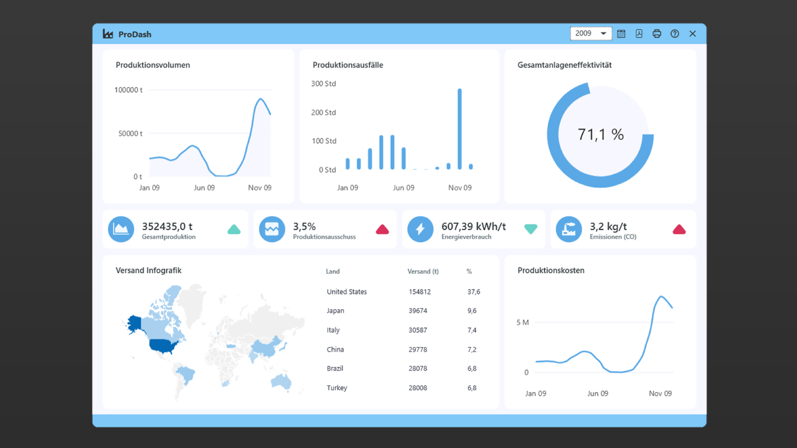

# Production Dashboard

Production Dashboard is a dashboard application designed to visualize key performance indicators (KPIs) for manufacturing operations. It provides a comprehensive overview of production metrics, enabling users to monitor and analyze data effectively. The application is written in C# using the Windows Presentation Foundation (WPF) framework and leverages the LiveCharts2 library for graphical representations.

## Features

### 1. Produktionsvolumen (Production Volume)
- **Description**: Displays monthly production volumes over the selected year.
- **Purpose**: Monitor trends in production output.

### 2. Produktionsausfälle (Production Losses)
- **Description**: Visualizes the number of hours of production breakdown per month.
- **Purpose**: Identify and analyze downtime patterns.

### 3. Gesamtanlageneffektivität (Overall Equipment Effectiveness)
- **Description**: Shows the equipment efficiency as a percentage.
- **Purpose**: Assess the effectiveness of production equipment.

### 4. Middle Bar Metrics
- **Description**: Displays key metrics for the selected year:
  - **Gesamtproduktion** (Total Production) in t
  - **Produktionsausschuss** (Production Defects) in %
  - **Energieverbrauch** (Energy Consumption) in kWh/T
  - **Emissionen (CO)** (Emissions) in kg/t
- **Purpose**: Provide a quick overview of critical yearly metrics.

### 5. Versand Infografik (Shipping Infographic)
- **Description**: Displays the countries where products were shipped and the corresponding quantities.
- **Purpose**: Visualize global shipping distribution.

### 6. Produktionskosten (Production Costs)
- **Description**: Tracks monthly production costs over the selected year.
- **Purpose**: Monitor cost trends and identify anomalies.

## Technologies Used
- **Programming Language**: C#
- **GUI Framework**: Windows Presentation Foundation (WPF)
- **Charting Library**: LiveCharts2
- **Database**: Microsoft SQL Server

## Installation

1. **Clone the Repository**  

2. **Set Up the Database**
   - Ensure you have Microsoft SQL Server installed.

3. **Build the Application**
   - Restore NuGet packages.
   - Build the solution.

4. **Run the Application**
   - Start the application from Visual Studio or by running the generated executable.

## Contributing
Contributions are welcome! If you have suggestions for improvements or new features, please create an issue or submit a pull request.

## License
This project is licensed under the MIT License. See the [LICENSE](LICENSE.txt) file for details.

## Acknowledgments
- [LiveCharts2](https://livecharts.dev/) for the charting library.

## Contact
For any inquiries or support, please [contact me](https://alexlitvin.com).
